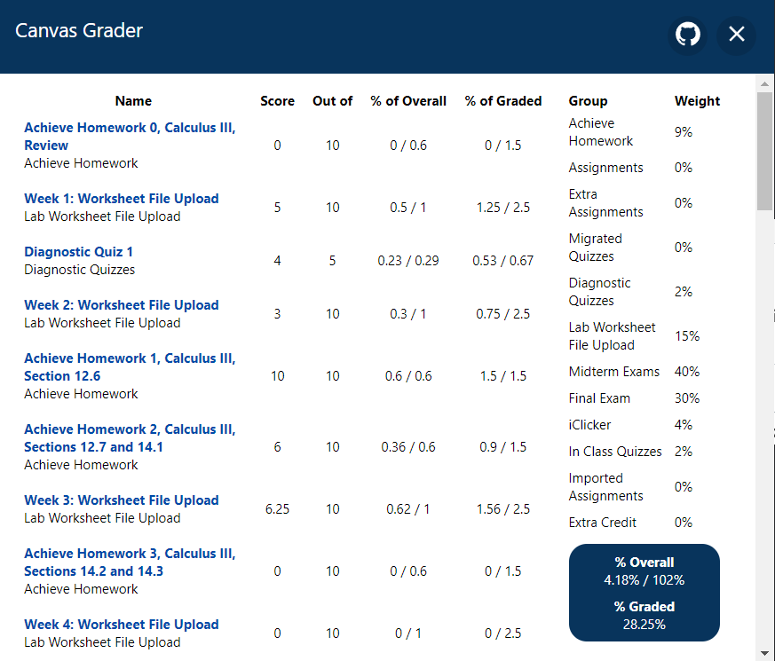

## Canvas Grader
This is an extension I wrote to quickly at a glance analyze my grades for classes that have their grades hidden.

### Installation
Download from the releases and unzip. Load the folder in it's entirety at `chrome://extensions`

It is being uploaded to the Chrome Store for convenience, but is still being processed.

### Features
✅ - Implemented

🐣 - Partially implemented

❌ - Not implemented (and planned)
| Description  | Status |
| ------------- | ------------- |
| Arithmetic Mean  | ✅  |
| What If Scores[^1] | ✅  |
| Show Category Grades | 🐣  |
| Geometric Mean  | ❌  |
| Custom Weighting[^2]  | ❌  |
| Calculate Needed Scores[^3]  | ❌  |

[^1]: Will calculate the grade based on "what if" scores if so desired
[^2]: Currently will only import weighted grades if possible (ie. an opiniated format utilized by the KU Math Department works).
[^3]: Calculate the needed score on the next exam/assignment to get a desired grade.

### Preview


### Contributing
Contributing is welcome whether through issues or PRs.

Basically the only commands you'll need is
```
yarn start //for previewing in browser any components
yarn build //for running the extension
```
Load the `./build` folder (after building) on the `chrome://extensions` page

Otherwise you should verify it passes lint/tsc tests:
`yarn lint` and `yarn tsc --noEmit`